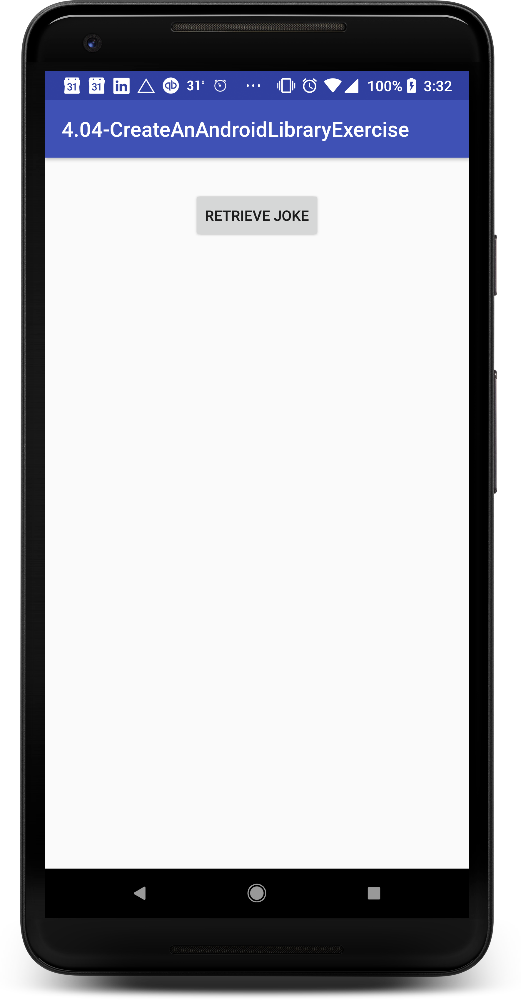
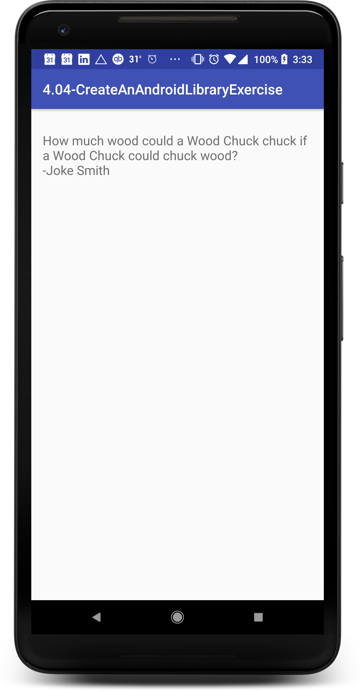

1. Create a new project in Android Studio, using all the defaults.

2. Create or reuse a Java library that can supply a joke.

3. Use the Android Studio wizard to add an Android Library project:
* File > New > New Module... > Android Library

4. Add a new activity to the library

5. Add a button to the main activity that retrieves a joke from the Java
library, packages the joke as an intent extra, and launches the activity from
the Android library.

6. Have the activity in the Android Library retrieve and display the joke.

